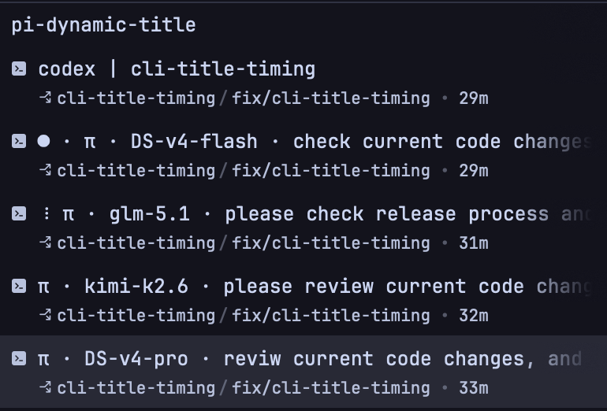

# pi-dynamic-title

Pi Coding Agent Extension that dynamically updates your terminal window/tab title to provide instant status, project context, and workspace feedback.



## Features

- **5-Segment Composable Title**: Customize your title layout from five available segments:
  - `status`: Runtime status indicator. Shows a Braille spinner (e.g. `⠋`) when running, a completion dot `●` when a task finishes, and empty when idle.
  - `agent`: Agent display name (defaults to `π`).
  - `worktree`: Git worktree / repository top-level directory name (defaults to CWD basename if outside Git).
  - `model`: Explicitly mapped short model name (e.g., `sonnet-4`, `DS-chat`, `gemini-2.0-flash`).
  - `title`: Direct display of the Pi Session Name.
- **Animation Separated by Space**: The running spinner is joined to the rest of the title with a plain space, independent of your configured segment separator.
- **Global-Only Configuration**: Settings are saved to `~/.pi/agent/settings.json` and apply to all new sessions. No per-session overrides.
- **No LLM Dependencies**: Displays the session name directly. Zero API network calls and zero API-key dependencies.
- **Dynamic Model Name Mapping**: Trims model names to save terminal title space:
  - Strip provider path prefix (e.g., `anthropic/claude-sonnet-4` → `claude-sonnet-4`).
  - Map `deepseek` to `DS` (case-insensitive).
  - Remove `claude` and its adjacent hyphens (e.g., `claude-sonnet-4` → `sonnet-4`).
  - Remove `preview` and its adjacent hyphens (e.g., `gemini-2.0-flash-exp-preview` → `gemini-2.0-flash-exp`).
  - Retain version-number hyphens (e.g. `gemini-1-5-pro` stays as-is).
- **Customizable Separator & Padding**: Choose any separator character (default mid dot `·`) with optional padding spaces around it.
- **Focus Detection (DECSET 1004)**: Instantly clears the task completion dot `●` when you refocus the terminal window. Falls back to `successDurationMs` when the terminal does not report focus events.
- **Interactive Commands**: Exposes `/dynamic-title` with subcommands for switching segments, separator, and renaming the session.

---

## Default Configuration

By default, the title segments are set to:
```json
["status", "agent", "model", "title"]
```

The `worktree` segment is available as a configurable option but is disabled by default.

---

## Installation

To install directly from GitHub:

```bash
pi install git:github.com/fangwangme/pi-dynamic-title
```

Or to target a specific version tag:

```bash
pi install git:github.com/fangwangme/pi-dynamic-title@v0.0.1
```

### Update

To update the extension to the latest version:

```bash
pi update git:github.com/fangwangme/pi-dynamic-title
```

---

## Configuration

Settings are stored in your global `~/.pi/agent/settings.json` under the `dynamicTitle` key:

```json
{
  "dynamicTitle": {
    "segments": ["status", "agent", "worktree", "model", "title"],
    "agentName": "π",
    "animationInterval": 80,
    "successDurationMs": 5000,
    "spinnerFrames": ["⠋", "⠙", "⠹", "⠸", "⠼", "⠴", "⠦", "⠧", "⠇", "⠏"],
    "separatorChar": "·",
    "separatorPadding": true,
    "maxTitleLength": 50
  }
}
```

### Environment Overrides
- `PI_DYNAMIC_TITLE_SEGMENTS`: Override active segments with a space-separated list (e.g. `status worktree title`).
- `PI_DYNAMIC_TITLE_AGENT_NAME`: Override default agent display name.

---

## Commands

| Command | Description |
|---------|-------------|
| `/dynamic-title` | Opens the main menu: Segments, Separator, Rename, Show Config. |
| `/dynamic-title segments` | Switch between presets or define a custom segment order. |
| `/dynamic-title separator` | Choose separator character and toggle padding. |
| `/dynamic-title rename` | Interactively rename the current Pi session. |

---

## Development & Verification

1. Install dependencies:
   ```bash
   bun install
   ```
2. Check typescript types:
   ```bash
   bun run check
   ```
